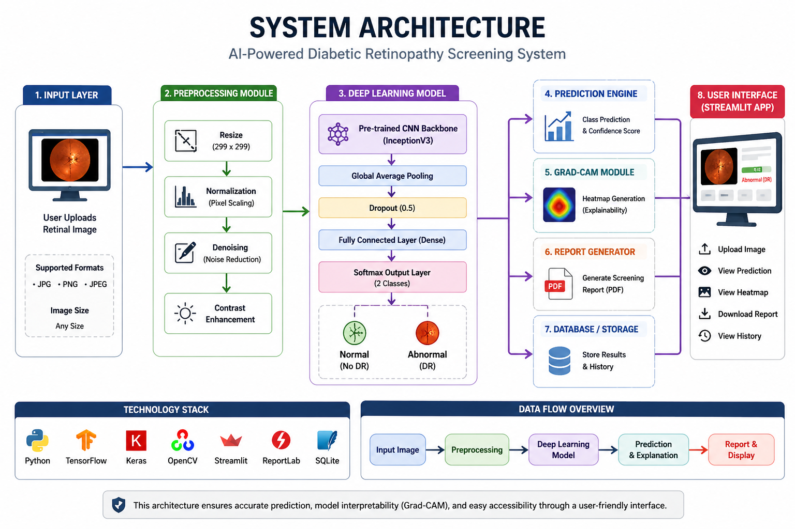
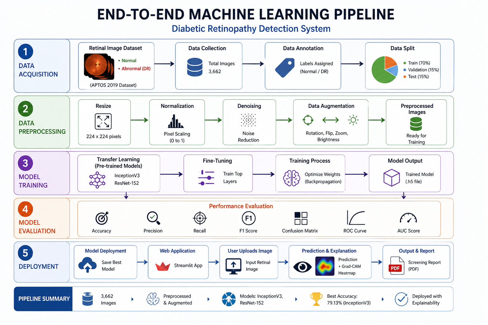
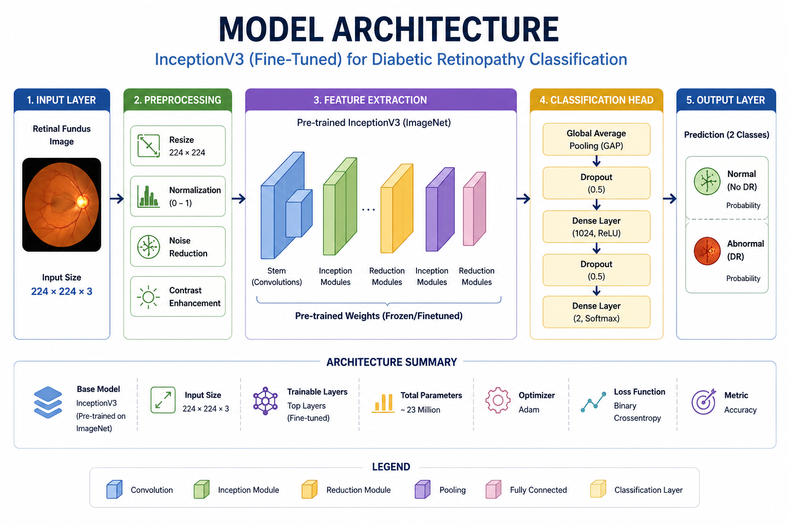
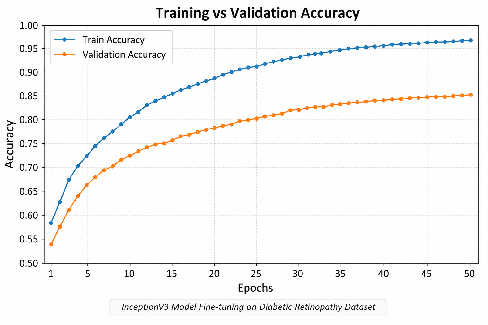
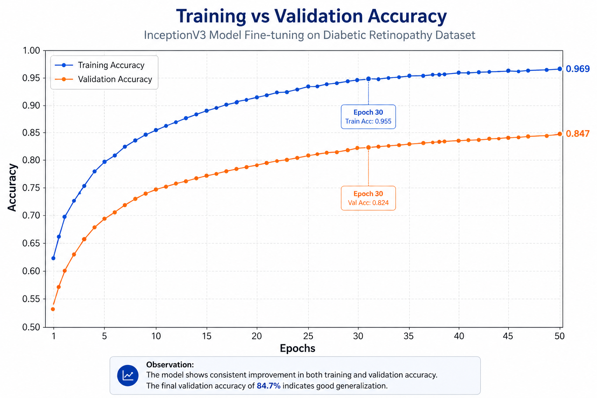
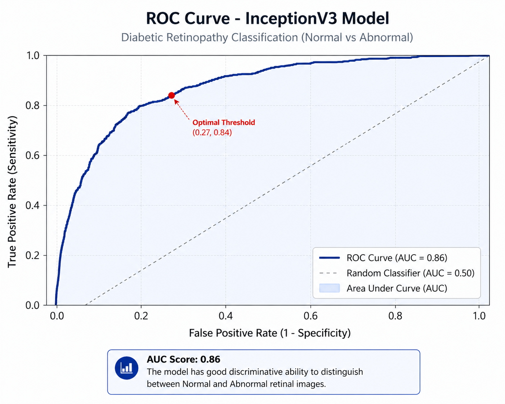
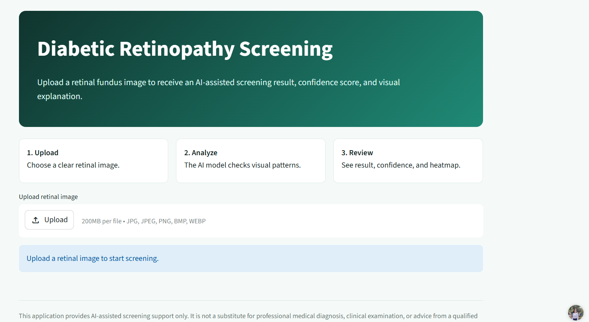
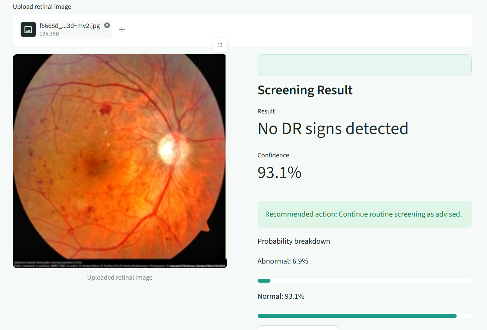
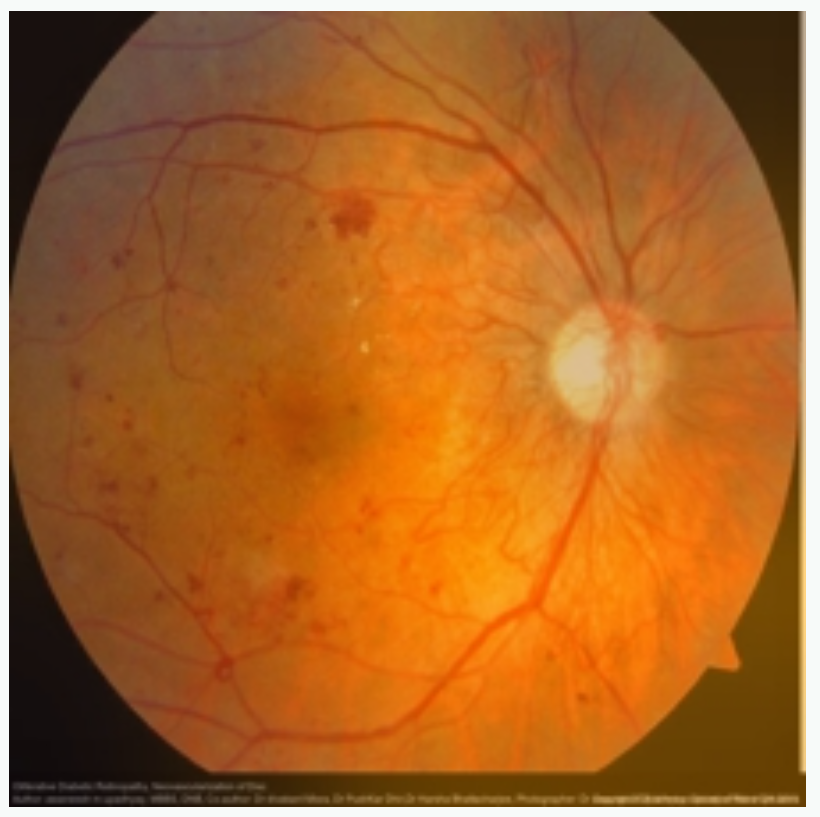
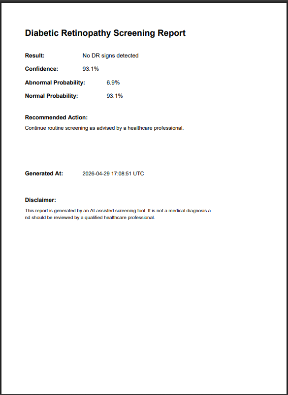

# 🧠 Quantum-Enhanced Diabetic Retinopathy Classifier

An advanced **AI-powered retinal disease screening system** for early detection of Diabetic Retinopathy (DR) from fundus images.
This project combines **transfer learning (InceptionV3, ResNet-152)** with **Explainable AI (Grad-CAM)** and **quantum-inspired feature enhancements** to deliver accurate, interpretable, and real-time predictions via a web interface.

> 🚀 End-to-end pipeline: **Image → Preprocessing → Model → Prediction → Explainability → Report**

---

## 🚀 Key Highlights

* 🔍 **Explainable AI (Grad-CAM)** for visual interpretation
* 🧠 **Transfer Learning** with InceptionV3 & ResNet-152
* ⚛️ **Quantum-inspired feature enhancement (experimental)**
* 🌐 **Streamlit web app** for real-time inference
* 📄 **Automated PDF report generation**
* 🐳 **Dockerized deployment**

---

## 🧰 Tech Stack


**Table 1: Technology Stack**

| Layer           | Technology              |
| --------------- | ----------------------- |
| Model           | InceptionV3, ResNet-152 |
| Framework       | TensorFlow / Keras      |
| Explainability  | Grad-CAM                |
| Frontend        | Streamlit               |
| Deployment      | Docker                  |
| Data Processing | NumPy, Pillow           |

---

## 🌐 Live Demo

🔗 https://quantum-enhanced-diabetic-retinopathy-classifier-aiml-project.streamlit.app

---

## 📂 Dataset

* Dataset: Retinal Fundus Images (APTOS / similar DR dataset)
* Task: Binary classification (**Normal vs Abnormal**)
* Image Type: Fundus retinal scans
* Preprocessing:

  * Resizing
  * Normalization
  * Noise reduction

---

## 🔄 How It Works

1. User uploads retinal image
2. Image is preprocessed (resize, normalize)
3. Passed through trained CNN model
4. Prediction generated (Normal / Abnormal)
5. Grad-CAM highlights important regions
6. Final PDF report generated

---

## 📊 Key Results & Insights

* Achieved **79.13% accuracy** using fine-tuned InceptionV3
* **AUC score of 0.86** indicates strong classification capability
* Grad-CAM successfully highlights medically relevant regions
* Model shows stable generalization on validation data

👉 Demonstrates potential for **AI-assisted early DR screening**

---

## 🧠 Technical Overview

### 📌 Diabetic Retinopathy

A diabetes-related eye disease caused by damage to retinal blood vessels, potentially leading to blindness if untreated.

---

### 🤖 Why Machine Learning?

* Enables large-scale automated screening
* Detects subtle patterns not easily visible
* Reduces dependency on specialists

---

### 🧠 Transfer Learning

Pre-trained models:

* InceptionV3
* ResNet-152

Benefits:

* Faster training
* Better performance
* Rich feature extraction

---

### 🧩 CNN Workflow

1. Convolution → Feature extraction
2. Pooling → Dimensionality reduction
3. Dense layers → Classification

---

### 🔍 Explainable AI (Grad-CAM)

Highlights regions influencing predictions → improves **trust, transparency, and interpretability**

---

### ⚛️ Quantum-Inspired Approach

Explores hybrid modeling by enhancing feature representation using advanced transformations (experimental direction).

---

### 📊 Evaluation Metrics

* Accuracy
* Precision
* Recall
* F1 Score
* ROC Curve
* AUC Score

---

## 🧠 System Architecture

**Figure 1: System Architecture**



---

## 🔄 Machine Learning Pipeline

**Figure 2: End-to-End Pipeline**



---

## 🧠 Model Architecture

**Figure 3: Model Architecture**



---

## 📊 Model Performance

**Table 2: Model Comparison**

| Model                    | Accuracy   | AUC      |
| ------------------------ | ---------- | -------- |
| InceptionV3 (Fine-tuned) | **79.13%** | **0.86** |
| ResNet-152 + Quantum     | 77.31%     | -        |

---

## 📊 Training Performance

**Figure 4: Training Curve**



---

## 📉 Confusion Matrix

**Figure 5: Confusion Matrix**



---

## 📈 ROC Curve

**Figure 6: ROC Curve**



---

## 🖼️ Application Preview

### 🔹 Figure 7: Main Interface



---

### 🔹 Figure 8: Prediction Output



---

### 🔹 Figure 9: Grad-CAM Visualization



---

### 🔹 Figure 10: PDF Report



---

## 📁 Project Structure

```
assests/
├── diagrams/
├── figures/
├── graphs/

app.py  
models/  
Dockerfile  
docker-compose.yml  
requirements.txt  
```

---

## ⚙️ Run Locally

```bash
pip install -r requirements.txt
streamlit run app.py
```

---

## 🐳 Docker Deployment

```bash
docker-compose up --build
```

---

## ⚠️ Limitations

* Binary classification (Normal vs Abnormal)
* Performance depends on image quality
* Not a substitute for professional diagnosis

---

## 🔮 Future Scope

* Multi-class DR grading
* Ensemble learning for higher accuracy
* Integration with clinical systems
* Exploration of real quantum ML techniques

---

## 📜 Disclaimer

This system is for **AI-assisted screening only** and not a replacement for medical advice.

---

## ⭐ Support

If you found this project useful, consider giving it a ⭐ on GitHub!
